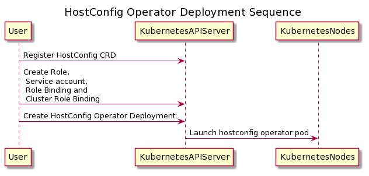
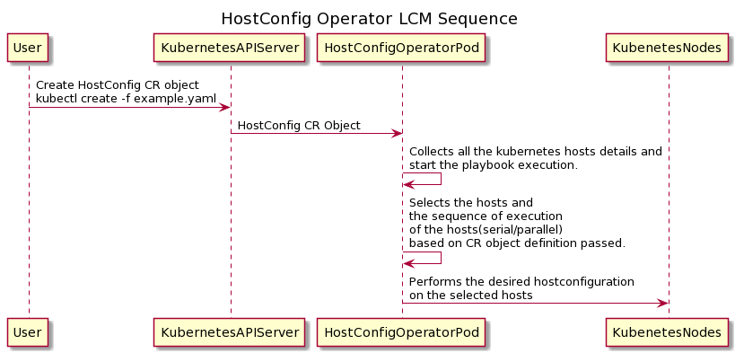

## HostConfig Operator

## Overview
An ansible based operator to perform host configuration LCM operations
on Kubernetes Nodes. It is built to execute the required configuration
on kubernetes nodes after the intial kubernetes setup is done on the nodes.
The application is deployed as a pod on the existing cluster itself.

Current implementation have been tested with running three replicas
of the hostconfig operator deployment launched on different master nodes
in the kubernetes setup.

Once the hostconfig operator is deployed and the corresponding CRD is
created on the kubernetes cluster, we can then create the HostConfig CR objects
to perform the required configuration on the nodes.

The host configuration on the kubernetes nodes is done by executing the
appropriate ansible playbook on that Kubernetes node by the
hostconfig operator pod.

## Scope and Features
* Perform host configuration LCM operations on Kubernetes hosts
* LCM operations managed using HostConfig CR objects
* Inventory built dynamically, at the time of playbook execution
* Connects to hosts using the secrets associated with the nodes, which have the
ssh keys associated in them.
* Supports execution based on host-groups, which are built based out of labels
associated with kubernetes nodes
* Supports serial/parallel execution of configuration on hosts
* Supports host selection with AND and OR operations of the labels mentioned
in the host-groups of the CR object
* Reconcile on failed nodes, based on reconcile period - feature available
from ansible-operator
* Current support is available to perform `sysctl` and `ulimit` operations
on the kubernetes nodes. Also any shell command that needs to be executed
on the nodes.
* Display the status of each Hostconfig CR object as part of the
`kubectl describe hostconfig <name>`
* We have also added an anisble role to execute the
"kubeadm alpha cert check-expiration" command and annotate the nodes
with expiration detail.

## Architecture

Hostconfig operator will be running as a kubernetes deployment on the target
kubernetes cluster.

This repository also have vagrants scripts to build kubernetes cluster on the
Vagrant VMs and has to deploy and configure the hostconfig-operator pod
on the K8 setup.

## Deployment and Host Configuration Flow

The hostconfig operator deployment sequence

Using operator pod to perform host configuration on kubernetes nodes

## How to Deploy(On existing kubernetes cluster)

**Pre-requisite:**

1. The Kubernetes nodes should be labelled with any one of the below label
to execute based on host-groups, if not labelled by default executes on
all the nodes as no selection happens.
    Valid labels:
    * [`topology.kubernetes.io/region`](https://kubernetes.io/docs/reference/kubernetes-api/labels-annotations-taints/#topologykubernetesiozone)
    * [`topology.kubernetes.io/zone`](https://kubernetes.io/docs/reference/kubernetes-api/labels-annotations-taints/#topologykubernetesioregion)
    * `kubernetes.io/role`
    * [`kubernetes.io/hostname`](https://kubernetes.io/docs/reference/kubernetes-api/labels-annotations-taints/#kubernetes-io-hostname)
    * [`kubernetes.io/arch`](https://kubernetes.io/docs/reference/kubernetes-api/labels-annotations-taints/#kubernetes-io-arch)
    * [`kubernetes.io/os`](https://kubernetes.io/docs/reference/kubernetes-api/labels-annotations-taints/#kubernetes-io-os)

2. **Operator pod connecting to Kubernetes Nodes:**

    The kubernetes nodes should be annotated with secret name having
    the username and private key as part of the contents.

    git clone the hostconfig repository

    `git clone https://opendev.org/airship/hostconfig-operator.git`

    Move to airship-host-config directory

    `cd hostconfig-operator/airship-host-config`

    Create a HostConfig CRD

    `kubectl create -f deploy/crds/hostconfig.airshipit.org_hostconfigs_crd.yaml`

    Create hostconfig role, service account, role-binding and
    cluster-role-binding which is used to deploy and manage the operations done
    using the hostconfig operator pod

    `kubectl create -f deploy/role.yaml`
    `kubectl create -f deploy/service_account.yaml`
    `kubectl create -f deploy/role_binding.yaml`
    `kubectl create -f deploy/cluster_role_binding.yaml`

    Now deploy the hostconfig operator pod

    `kubectl create -f deploy/operator.yaml`

    Once the hostconfig operator pod is deployed, we can create the desired
    HostConfig CR with the required configuration. And this CR is passed to the
    operator pod which performs the required operation.

    Some example CRs are available in the demo_examples directory.

    Please refer to README.md file for more detailed steps.

## References

1. https://docs.openshift.com/container-platform/4.1/applications/operator_sdk/osdk-ansible.html
2. https://github.com/operator-framework/operator-sdk
3. https://docs.ansible.com/ansible/latest/modules/sysctl_module.html
4. https://docs.ansible.com/ansible/latest/modules/pam_limits_module.html
