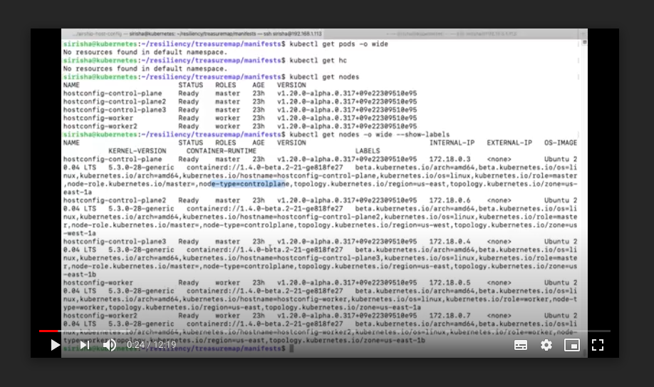

## HostConfig-Operator tested with Node Resiliency

Tested hostconfig-operator in a HA mode and also when the node
goes down on which the leader pod is launched. Here are the
scenarios tested and configuration used

### Topology and Configuration Details

Launched hostconfig-operator with 3 replica-sets on a
kubernetes cluster having 3 master and 5 worker nodes.
The deployment has nodeantiaffinity rule and tolerations
so that each pod is launched on a different master node.
So 3 master have one replica of the hostconfig-operator pod
running on them.

Please refer to operator.yaml file for deployment details.

Once all the pods comes to running state, we can check
the pod logs to see which pod has been elected as leader pod.

### Scenarios tested for Node Resiliency

Once the pods are up and running and the leader pod is elected,
executed a sample CR object(demo_examples/example_host_groups.yaml).
This CR object will be executed by the leader pod.

After the above CR has executed successfully, simulated some
failure scenario on couple of nodes and executed a new CR object.
This CR object keeps failing and will be trying to reconcile until
successful by the hostconfig-operator pod.

Now drained the kubernetes node on which the leader pod is launched
and simultaneously executed a new CR object just before draining the node.
Once the node gets drained and the pod is deleted new pod is
elected as leader. The third replica pod which tries to come up
will be in pending state as there will be no more master nodes
available to launch the new pod.

The new leader which has been elected as leader reads all the HostConfig CR
objects present in the cluster and tries to execute each CR sequentially.
At the same time if any CR fails to execute the pod tries reconcile the CR
until it is successful.

#### Scenarios

1. Launch a HA setup with 3 pods running on different masters.
Create a new CR and validate the execution by the leader pod.
Check the status of the hc (kubectl get hc example1 -o json).
Now delete the leader node(cordoned).
Behaviour: CR is executed again by the new HostConfig Leader pod.

2. Launch a HA setup, create a CR and when CR has started the
execution delete the leader node(cordoned). And check if the new leader
is again executing the CR.
Behavior :The new pod should re-execute the CR again from starting and stop
when all nodes executed successfully.

3. Launch a HA setup, apply  a successful CR and when the  CR is completed.
Apply a new CR i.e. sysctl-ulimit. Such that the second CR works for  few nodes
successfully and fails for the remaining nodes. As the pod keeps trying to
execute on all the nodes, delete the leader pod and uncordon the node.
Behavior: The pod gets each CR object and re-executes again until they
execute successfully. And the second CR which was failing will also gets
executed again and the new pod re-attempts to run on that CR until successful.

4. When number of replicas of hostconfig-operator are more than number
of master nodes pods should be in pending state as it is one pod per node.
Behavior: Pod is expected to be in pending state waiting for the node
to be available.

5. Multiple CR are applied continuously.
Behavior: Tested with 20 HC and are applied sequentially.

Video demonstrating the node resiliency behaviour of HostConfig-Operator Pod:
It demonstrates all the above scenarios consolidated.

